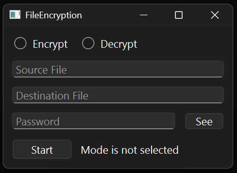
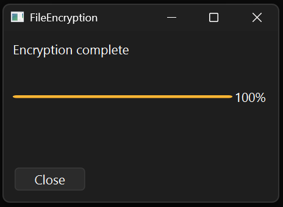

## 1. Introduction

This is the GUI, password-based file encryption/decryption tool using AES-256-GCM.

 </br>
  </br>


## 2. Features

* AES-256-GCM algorithm for file encryption and integrity check
* Argon2id for key derivation from password
* Qt library for graphical user interface
* Double buffering and asynchronous write for better performance 
* Asynchronous, multithread processing for non-blocking UI
* Real-time progress tracking and cancellation support
* Error report and automatic stop when error occurs
* Cross-platform support for Windows and Linux

### 2-1. Why use this?

* **AES-GCM**
	* **AES**
		* Most used encryption algorithm, de facto industry standard
		* Chosen by NIST, trusted by many governments and corporations
		* Modern processors support hardware acceleration for AES
	* **GCM**
		* Does not require padding, immune to padding oracle attack
		* Can be parallelized in both encryption and decryption process 
		* Provides both confidentiality and integrity using AEAD

* **Argon2id**
	* Winner of 2015 Password Hashing Competition
	* Hybrid of Argon2i and Argon2d, balances strength of both algorithms
		* Argon2i: Data independent memory access, resistant to side channel attack
		* Argon2d: Memory hard function, resistant to brute force attack using GPU or ASIC

### 2-2. Security Considerations

* AES-GCM tag provides integrity check; corrupted or tampered ciphertext files are rejected before decryption starts
* Ensured memory wipe for sensitive data using RAII pattern and `SecureZeroMemory`/`explicit_bzero`
* Keys are locked in memory using `VirtualLock`/`mlock` to prevent them from being swapped to disk
* Newly and randomly generated salt and initial vector for each session, using OS-provided CSPRNG (`BCryptGenRandom`/`getrandom`)

## 3. Specifications

* **Maximum File Size:** 64 GiB (2 ^ 32 blocks, limitation of 32-bit counter)

* **AES-256-GCM**
	* **IV Size:** 96 bits (recommended for AES-256-GCM)
	* **Key Size:** 256 bits (using AES-256)
	* **Block Size:** 128 bits (using AES)
	* **Authentication Tag Size:** 128 bits

* **Argon2id**
	* **Memory Cost:** 512 MiB
	* **Time Cost:** 4 iterations
	* **Parallelism:** All available CPU cores
	* **Salt Size:** 128 bits

* **Buffer Size:** 4096 blocks (64 KiB)

### 3-1. Encrypted File Format

```
Salt (16 Bytes) │ IV (12 Bytes) │ Encrypted Data │ Tag (16 Bytes)
```

### 3-2. Source Code Architecture

```
Source
├── Common
│   ├── constants.h        # Constant values
│   └── main.cpp           # Application entry point
├── Core
│   ├── AES_GCM.h/cpp      # AES-GCM engine
│   ├── AES_GCM_enc.cpp    # Encryption implementation
│   ├── AES_GCM_dec.cpp    # Decryption implementation
│   └── Worker.h/cpp       # Asynchronous worker thread
├── GUI
│   ├── MainGUI.h/cpp      # Main workflow controller
│   ├── InputGUI.h/cpp     # Source, destination, and password input
│   ├── ProgressGUI.h/cpp  # Progress tracking
│   ├── ModeButton.h/cpp   # Encrypt/Decrypt mode selection widget
│   └── PWLineEdit.h/cpp   # Password input widget
└── Utils
    ├── Password.h/cpp     # Secure password container
    └── library.h.cpp      # Utility functions
```

### 3-3. Limitations

* Maximum 64 GiB file
* No batch encryption (Single file only)
* No CLI mode (GUI only)
* No key file support (Password-based key only)
* No log file (GUI message and progress bar only)
* No original file removal

## 4. Build and Usage
### 4-1. Prerequisites

**Windows:**
* Visual Studio 2022+ with C++ workload
* CMake 3.16+
* vcpkg
* Qt 6.7+

**Linux:**
* GCC 11+ or Clang 14+
* CMake 3.16+
* Qt6 development packages

### 4-2. Build

**Windows:**
```cmd
# Install dependencies
vcpkg install openssl:x64-windows argon2:x64-windows gtest:x64-windows

# Configure and build
cd Projects/FileEncryption
cmake -B build -DCMAKE_BUILD_TYPE=Release -DCMAKE_TOOLCHAIN_FILE=%VCPKG_ROOT%/scripts/buildsystems/vcpkg.cmake
cmake --build build --config Release
```

**Linux:**
```bash
# Install dependencies
sudo apt-get install qt6-base-dev libssl-dev libargon2-dev libgtest-dev

# Configure and build
cd Projects/FileEncryption
cmake -B build -DCMAKE_BUILD_TYPE=Release
cmake --build build
```

### 4-3. Usage





1. Run the executable `FileEncryption.exe` or `FileEncryption`
2. Select mode
3. Enter source file path
4. Enter destination file path
5. Enter password
6. Click Start

## 5. Testing
### 5-1. Coverage


| File                 | Tracked Lines | Covered | Partial | Missed | Coverage % |
| -------------------- | ------------- | ------- | ------- | ------ | ---------- |
| Core/AES_GCM.cpp     | 40            | 36      | 0       | 4      | 90.00%     |
| Core/AES_GCM.h       | 4             | 4       | 0       | 0      | 100.00%    |
| Core/AES_GCM_dec.cpp | 76            | 74      | 0       | 2      | 97.37%     |
| Core/AES_GCM_enc.cpp | 74            | 72      | 0       | 2      | 97.30%     |
| Utils/Password.cpp   | 23            | 23      | 0       | 0      | 100.00%    |
| Utils/Password.h     | 21            | 21      | 0       | 0      | 100.00%    |
| Utils/library.h      | 80            | 78      | 0       | 2      | 94.44%     |

| Module   | Test File          | Test Cases                                                             |
| -------- | ------------------ | ---------------------------------------------------------------------- |
| AES_GCM  | `AES_GCM_Test.cpp` | Encrypt/Decrypt, Integrity Check, Edge Cases, Callbacks                |
| Password | `PasswordTest.cpp` | RAII, Copy/Move Semantics, Memory Safety                               |
| Utils    | `UtilsTest.cpp`    | File I/O, Delete, Existence Check, Key Derivation, CSPRNG, Memory Wipe |

**Note:** GUI files, error messages for external libraries and system calls are excluded from tests.

### 5-2. Running Tests

**Windows:**
```cmd
cd Projects/FileEncryption
ctest --test-dir build -C Release --output-on-failure
```

**Linux:**
```bash
cd Projects/FileEncryption
ctest --test-dir build --output-on-failure
```

### 5-3. Continuous Integration

| Check | Windows | Linux |
|-------|---------|-------|
| Build | ✅ MSVC 2022 | ✅ GCC 11+ |
| Unit Tests | ✅ | ✅ |
| Static Analysis (cppcheck) | - | ✅ |
| Coverage Report | - | ✅ Codecov |

## 6. Benchmark

* **Test Environment** (Local)
	* **OS:** Windows 11 Pro
	* **CPU:** Intel Core i9-13980HX (24 Cores / 32 Threads)
	* **RAM:** 16 GB DDR5-4800
	* **Storage:** Micron 2400 NVMe SSD (1TB)
	* **File Size:** 4 GiB

* **Results** (on cold start)
	* **Encryption:** 1.1~1.3GB/s
	* **Decryption:** 1.2~1.3GB/s
	* **Argon2id Key Derivation:** 430ms

* **Results** (after warm-up)
	* **Encryption:** 1.9~2.1GB/s
	* **Decryption:** 2.0~2.1GB/s
	* **Argon2id Key Derivation:** 310ms

**Running Benchmarks Locally:** 
```cmd
cd Projects/FileEncryption
cmake -B build -DCMAKE_BUILD_TYPE=Release -DCMAKE_TOOLCHAIN_FILE="%VCPKG_ROOT%/scripts/buildsystems/vcpkg.cmake" -DCMAKE_PREFIX_PATH="C:/Qt/6.10.1/msvc2022_64" -DVCPKG_TARGET_TRIPLET=x64-windows
cmake --build build --config Release --target FileEncryption-bench
.\build\Release\FileEncryption-bench.exe
```

## 7. License

* This project is licensed under the MIT License. See [LICENSE.md](LICENSE.md) for more details.
* This project uses the following third-party libraries. See [LICENSES-THIRD-PARTY.md](LICENSES-THIRD-PARTY.md) for more details.
	- OpenSSL (Apache 2.0)
	- Argon2 (CC0/Apache 2.0)
	- Qt (LGPL v3)
	- Google Test (BSD 3-Clause)
