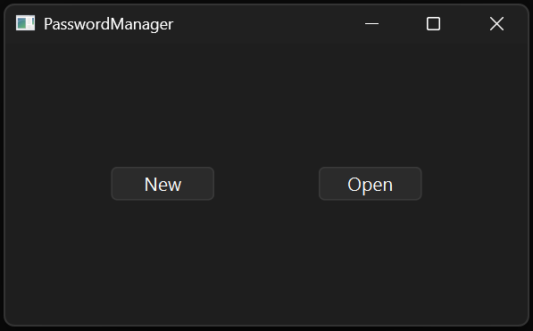
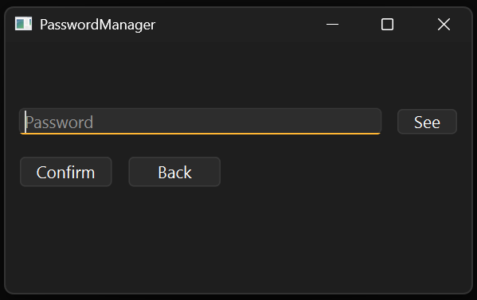
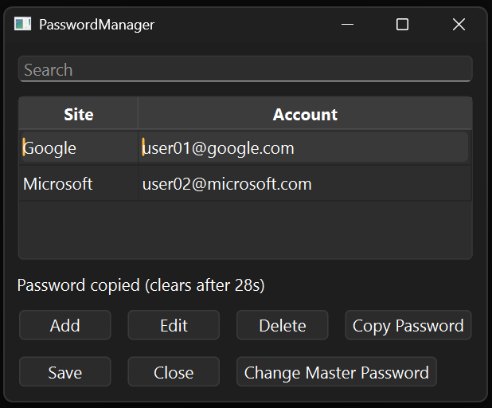
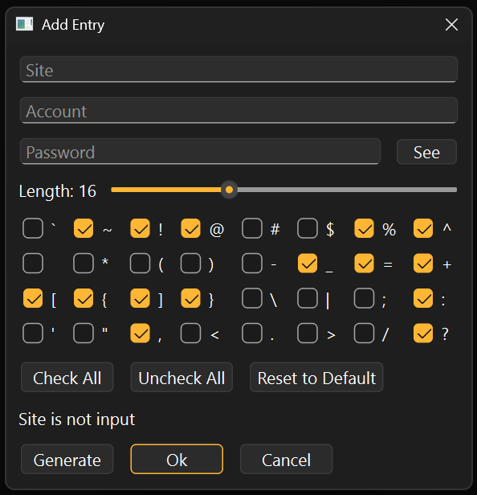
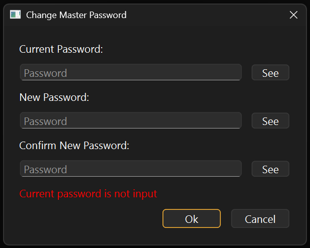

## 1. Introduction

This is the GUI-based password manager tool using AES-256-GCM.

 </br>
  </br>


## 2. Features

* Vault file encrypted with AES-GCM algorithm
* Argon2id for key derivation from master password
* Qt library for graphical user interface
* Random password generation with selectable special characters
* Automatic clipboard clear after 30 seconds of password copy
* Search and filter entries by keyword
* Re-encryption of vault file for each save or master password change
* Cross-platform support for Windows and Linux

### 2-1. Why use this?

* **AES-GCM**
	* **AES**
		* Most used encryption algorithm, de facto industry standard
		* Chosen by NIST, trusted by many governments and corporations
		* Modern processors support hardware acceleration for AES
	* **GCM**
		* Does not require padding, immune to padding oracle attack
		* Can be parallelized in both encryption and decryption process 
		* Provides both confidentiality and integrity using AEAD

* **Argon2id**
	* Winner of 2015 Password Hashing Competition
	* Hybrid of Argon2i and Argon2d, balances strength of both algorithms
		* Argon2i: Data independent memory access, resistant to side channel attack
		* Argon2d: Memory hard function, resistant to brute force attack using GPU or ASIC

### 2-2. Security Considerations

* Keys are locked in memory using `VirtualLock`/`mlock` to prevent swapping to disk
* RAII class for secure password handling, which ensures data wipe on error or cancellation
* Salt and IV are newly and randomly generated each time using OS-provided CSPRNG (`BCryptGenRandom`/`getrandom`)
* Sensitive data (passwords, keys, buffers) are ensured to be wiped using `SecureZeroMemory`/`explicit_bzero`
* Tampered or corrupted files are rejected before any decrypted data output
* Magic number validation to distinguish vault files
* Automatic clipboard clear after 30 seconds of password copy
* Random password generator guarantees at least one each of uppercase, lowercase, digit, and special character

## 3. Specifications

* **AES-256-GCM**
	* **IV Size:** 96 bits (recommended for AES-256-GCM)
	* **Key Size:** 256 bits (using AES-256)
	* **Block Size:** 128 bits (using AES)
	* **Authentication Tag Size:** 128 bits

* **Argon2id**
	* **Memory Cost:** 512 MiB
	* **Time Cost:** 4 iterations
	* **Parallelism:** All available CPU cores
	* **Salt Size:** 128 bits

* **Entry**
	* **Maximum Site Name Length:** 256 characters
	* **Maximum Account Length:** 256 characters
	* **Maximum Password Length:** 256 characters

* **Vault**
	* **Maximum Vault File Size:** 2 GiB
	* **Maximum Master Password Length:** 256 Characters

### 3-1. Vault File Format

**Vault Format:** 
```
Magic Number (4 Bytes) | Salt (16 Bytes) | IV (12 Bytes) | Encrypted Data | Tag (16 Bytes)
```

**Encrypted Data Format:** 
```
Entry Count (4 Bytes) | Entries
```

**Entry Format:** 
```
Site Name Length (4 Bytes) | Site Name | Account Length (4 Bytes) | Account | Password Length (4 Bytes) | Password
```

**Entry Example:** 
```
{ 
	site: "Google", 
	acc: "username@google.com", 
	pw: "password" 
}
```

### 3-2. Source Code Architecture

```
Source
├── Common
│   ├── constants.h        # Constant values
│   └── main.cpp           # Application entry point
├── Core
│   ├── AES_GCM.h/cpp      # AES-GCM engine
│   ├── AES_GCM_enc.cpp    # Encryption implementation
│   ├── AES_GCM_dec.cpp    # Decryption implementation
│   ├── Entry.h/cpp        # Password entry struct with serialization
│   ├── Vault.cpp          # Vault basic functions
│   ├── Vault_file.cpp     # Vault file management (new, open, save)
│   └── Vault_entry.cpp    # Vault entry CRUD operations
├── GUI
│   ├── MainGUI.h/cpp      # Main workflow controller
│   ├── LoginGUI.h/cpp     # Vault file selection
│   ├── PasswordGUI.h/cpp  # Master password input
│   ├── ListGUI.h/cpp      # Entry list with search line
│   ├── EntryGUI.h/cpp     # Entry add/edit dialog with password generator
│   ├── ChangePWGUI.h/cpp  # Master password change dialog
│   └── PWLineEdit.h/cpp   # Password input component with show/hide toggle
└── Utils
    ├── Password.h/cpp     # Secure password container
    └── library.h.cpp        # Utility functions
```

### 3-3. Limitations

* No CLI mode (GUI only)
* No key file support (Password-based key only)
* No cloud sync (Local vault file only)
* No auto-lock on idle

## 4. Build and Usage
### 4-1. Prerequisites

**Windows:**
* Visual Studio 2022+ with C++ workload
* CMake 3.16+
* vcpkg
* Qt 6.7+

**Linux:**
* GCC 11+ or Clang 14+
* CMake 3.16+
* Qt6 development packages

### 4-2. Build

**Windows:**
```cmd
# Install dependencies
vcpkg install openssl:x64-windows argon2:x64-windows gtest:x64-windows

# Configure and build
cd Projects/PasswordManager
cmake -B build -DCMAKE_BUILD_TYPE=Release -DCMAKE_TOOLCHAIN_FILE=%VCPKG_ROOT%/scripts/buildsystems/vcpkg.cmake
cmake --build build --config Release
```

**Linux:**
```bash
# Install dependencies
sudo apt-get install qt6-base-dev libssl-dev libargon2-dev libgtest-dev

# Configure and build
cd Projects/PasswordManager
cmake -B build -DCMAKE_BUILD_TYPE=Release
cmake --build build
```

### 4-3. Usage











1. Run the executable `PasswordManager.exe` or `PasswordManager`
2. Create a new vault or open an existing vault
3. Enter master password
4. Add, edit, or delete password entries
5. Click Save to encrypt and store the vault

## 5. Testing
### 5-1. Coverage


| Module   | Test File            | Test Cases                                                                 |
| -------- | -------------------- | -------------------------------------------------------------------------- |
| AES_GCM  | `AES_GCM_Test.cpp`   | Encrypt/Decrypt, Integrity Check, Edge Cases, Callbacks                    |
| Entry    | `EntryTest.cpp`      | Size Calculation, Serialization/Deserialization, Comparator, Set Insertion |
| Password | `PasswordTest.cpp`   | RAII, Copy/Move Semantics, Constant-time Compare, Memory Safety, Max Size  |
| Utils    | `UtilsTest.cpp`      | File I/O, Delete, Existence Check, Key Derivation, CSPRNG, Memory Wipe     |
| Vault    | `VaultEntryTest.cpp` | Create, Update, Delete, Duplicate Check, Accessor                          |
| Vault    | `VaultFileTest.cpp`  | New Vault, Open, Save, Round-trip, Password Change, Error Handling         |

**Note:** GUI files, error messages for external libraries and system calls are excluded from tests.

### 5-2. Running Tests

**Windows:**
```cmd
cd Projects/PasswordManager
ctest --test-dir build -C Release --output-on-failure
```

**Linux:**
```bash
cd Projects/PasswordManager
ctest --test-dir build --output-on-failure
```

### 5-3. Continuous Integration

| Check | Windows | Linux |
|-------|---------|-------|
| Build | ✅ MSVC 2022 | ✅ GCC 11+ |
| Unit Tests | ✅ | ✅ |
| Static Analysis (cppcheck) | - | ✅ |
| Coverage Report | - | ✅ Codecov |

## 6. License

* This project is licensed under the MIT License. See [LICENSE.md](LICENSE.md) for more details.
* This project uses the following third-party libraries. See [LICENSES-THIRD-PARTY.md](LICENSES-THIRD-PARTY.md) for more details.
	- OpenSSL (Apache 2.0)
	- Argon2 (CC0/Apache 2.0)
	- Qt (LGPL v3)
	- Google Test (BSD 3-Clause)
